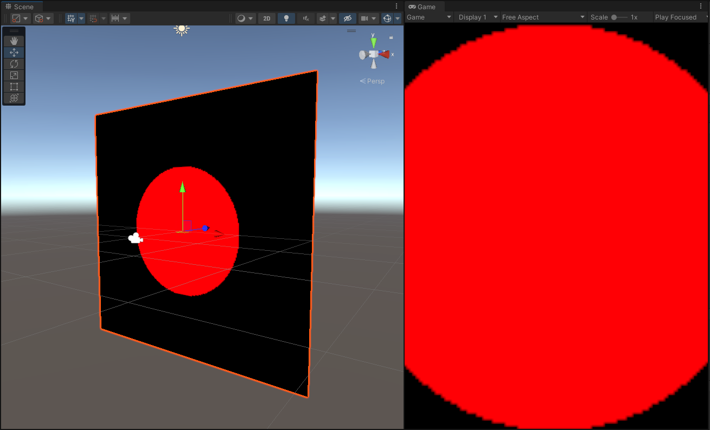
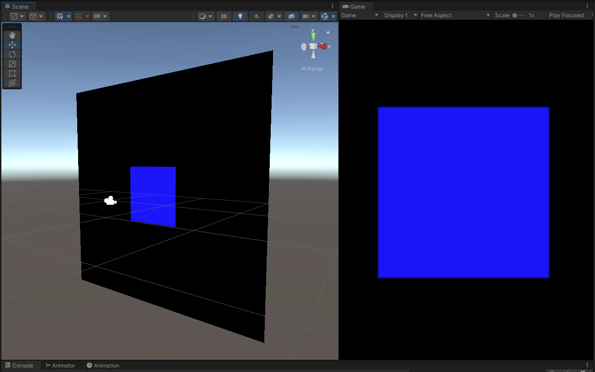
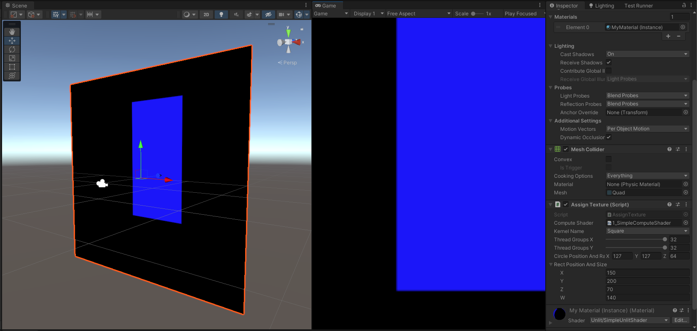

# Basic Compute Shaders

Written in HLSL in **Unity 2021.3.10f1**

### References

- [Compute Shaders course by Nik Lever](https://www.udemy.com/course/compute-shaders)

## Sections

- [Definition of the Compute Shader](#definition-of-the-compute-shader)
- [Dispatching the Compute Shader](#dispatching-the-compute-shader)
  - [Render Texture](#render-texture)
  - [Renderer](#renderer)
  - [Kernel Index](#kernel-index)
  - [Texture Assignment](#texture-assignment)
  - [Dispatching](#dispatching)
- [Multiple Kernels](#multiple-kernels)
- [Using Group ID and Thread ID](#using-group-id-and-thread-id)
  - [Painting each quadrant with a different color](#painting-each-quadrant-with-a-different-color)
  - [Circle](#circle)
  - [Square](#square)
- [Passing values to the Compute Shader](#passing-values-to-the-compute-shader)

## Definition of the Compute Shader

- The **#pragma** declaration lets the compiler know the function name associated with the kernel definition.
- A Texture 2D buffer is defined as the result of the computation by declaring the `RWTexture2D<float4> Result`.
- `[numthreads(8,8,1)]` specifies that the thread group will have 8x8x1 number of threads, each working on a pixel on parallel.
  - We use 1 for the z dimension, because we don't need 3D depth.
  - 8x8 will be the size of the square of pixels handled by this thread group.
  - On a **256x256** pixel texture, we need **32x32x1** thread groups, each covering **8x8x1** pixels. All this will be parallelized.

```hlsl
// Each #kernel tells which function to compile; you can have many kernels
#pragma kernel CSMain

// Create a RenderTexture with enableRandomWrite flag and set it
// with cs.SetTexture
RWTexture2D<float4> Result;

[numthreads(8,8,1)]
void CSMain (uint3 id : SV_DispatchThreadID)
{
    Result[id.xy] = float4(1, 0, 0, 0);
}
```

## Dispatching the Compute Shader

### Render Texture

- Create a **Render Texture** object, which will act as the output of the **Compute Shader** computation.

```cs
int TEXTURE_RESOLUTION = 256;

// initialize the texture with just x and y dimensions, it could have z depth
_renderTexture = new RenderTexture(TEXTURE_RESOLUTION, TEXTURE_RESOLUTION, 0);

// allow the compute shader to write to the texture
_renderTexture.enableRandomWrite = true;

// RenderTexture constructor does not actually create the hardware texture
// https://docs.unity3d.com/ScriptReference/RenderTexture.Create.html
_renderTexture.Create();
```

### Renderer

- Get a hold of the current **Renderer** of the game object's mesh.

```cs
_renderer = GetComponent<Renderer>();
_renderer.enabled = true;
```

### Kernel Index

- Get a reference to the **kernel** id from the **Compute Shader**, which corresponds to the main function being executed.

```cs
// get a reference to the kernel defined in the #pragma inside the compute shader
_kernelIndex = computeShader.FindKernel("CSMain");
```

### Texture Assignment

- Assign the **Render Texture** to the **Compute Shader**, so that it can write to it.
- Assign the **Render Texture** to the **Material** in the renderer, so it can use it.

```cs
// set the texture to the compute shader, so it can write to it
computeShader.SetTexture(_kernelIndex, "Result", _renderTexture);

// set the texture to the material, so it can use the texture
_renderer.material.SetTexture("_MainTex", _renderTexture);
```

### Dispatching

- Our compute shader has **numthreads(8,8,1)** per each thread group.
- That means it will compute a square of 8x8x1 pixels or threads, per each thread group.
- **Dispatch()** takes in the amount of thread groups it should have in all 3 dimensions.
- 32 thread groups means 32 \* 8 = 256 pixels, that covers the whole texture.

```cs
// dispatches the kernel with the amount of thread groups = x * y * 1
// we keep z = 1 because we are working on a 2D texture, no need for depth
computeShader.Dispatch(_kernelIndex, x, y, 1);
```

<!-- 1.mp4 -->

https://user-images.githubusercontent.com/4588601/197791116-834b7201-975e-4280-89fb-c26432eb9b5b.mp4

## Multiple Kernels

- The **Compute Shader** can have more than one **#pragma** declaration to define kernels.
- Then in the C# code, a reference to each **kernel** can be kept and used separately.

```c
// Each #kernel tells which function to compile; you can have many kernels
#pragma kernel SolidRed
#pragma kernel SolidYellow

[numthreads(8,8,1)]
void SolidRed (uint3 id : SV_DispatchThreadID)
{
    Result[id.xy] = float4(1, 0, 0, 1);
}

[numthreads(8,8,1)]
void SolidYellow (uint3 id : SV_DispatchThreadID)
{
    Result[id.xy] = float4(1, 1, 0, 1);
}
```

<!-- 2.mp4 -->

https://user-images.githubusercontent.com/4588601/197801280-3977400e-b9eb-470c-9e31-303aa82918fa.mp4

## Using Group ID and Thread ID

- When the **Compute Shader** is dispatched, we indicate how many thread groups there will be, **32x32** thread groups mean **32** in each axis.
- Given the **numthreads(8,8,1)**, each thread will handle **8x8** pixels of the total **256x256** pixels of the texture.
- If we are in the **thread group id (1,2,0)** and in the **thread id (3,4,0)**, that means we will be in the pixel given by **(1,2,0) \* (8,8,1) + (3,4,0) = (1\*8 + 3, 2\*8 + 4, 0\*1 + 0)**, which is pixel **(11, 20, 0)**.

### Painting each quadrant with a different color

- The following code makes each quadrant be:
  - **Left-Bottom** quadrant will be **black**.
  - **Left-Top** quadrant will be **green**.
  - **Right-Top** quadrant will be **yellow**.
  - **Right-Bottom** quadrant will be **red**.

```c
[numthreads(8,8,1)]
void SplitScreen (uint3 id : SV_DispatchThreadID)
{
    float halfTextureSize = TextureResolution / 2;

    float4 green = float4(0, 1, 0, 1) * step(halfTextureSize, id.y);
    float4 red = float4(1, 0, 0, 1) * step(halfTextureSize, id.x);

    Result[id.xy] = green + red;
}
```

<!-- 3.mp4 -->

https://user-images.githubusercontent.com/4588601/197843481-7bda9e1b-7f7c-4e62-b912-acd9810b9cf9.mp4

### Circle

- Paint with red only pixels that are inside the circle.

```c
[numthreads(8,8,1)]
void Circle (uint3 id : SV_DispatchThreadID)
{
    float desiredRadius = CirclePositionAndRadius.z;
    float center = CirclePositionAndRadius.xy;
    float distanceToCenter = length(id.xy - center);

    float isInCircle = 1 - step(desiredRadius, distanceToCenter);

    Result[id.xy] = float4(1, 0, 0, 1) * isInCircle;
}
```



### Square

- Paint with red only pixels that are inside the square.

```c
[numthreads(8,8,1)]
void Square (uint3 id : SV_DispatchThreadID)
{
    float center = RectPositionAndSize.xy;
    float width = RectPositionAndSize.z;
    float height = RectPositionAndSize.w;
    float halfWidth = width / 2;
    float halfHeight = height / 2;

    float isInRectX = step(center - halfWidth, id.x) - step(center + halfWidth, id.x);
    float isInRectY = step(center - halfHeight, id.y) - step(center + halfHeight, id.y);
    float isInRect = isInRectX * isInRectY;

    Result[id.xy] = float4(0, 0, 1, 1) * isInRect;
}
```



## Passing values to the Compute Shader

- Values can be passed from **C#** into the **HLSL** code.

> MyScript.cs

```cs
private const int TEXTURE_RESOLUTION = 256;

public Vector3 CirclePositionAndRadius = new Vector3(0, 0, 64);
public Vector4 RectPositionAndSize = new Vector4(0, 0, 64, 64);

private RenderTexture _renderTexture;
```

```cs
// set the texture to the compute shader, so it can write to it
computeShader.SetTexture(_kernelIndex, "Result", _renderTexture);
computeShader.SetInt("TextureResolution", TEXTURE_RESOLUTION);
computeShader.SetVector("CirclePositionAndRadius", CirclePositionAndRadius);
computeShader.SetVector("RectPositionAndSize", RectPositionAndSize);
```

> MyCompureShader.compute

```c
RWTexture2D<float4> Result;
int TextureResolution;
float3 CirclePositionAndRadius;
float4 RectPositionAndSize;
```



